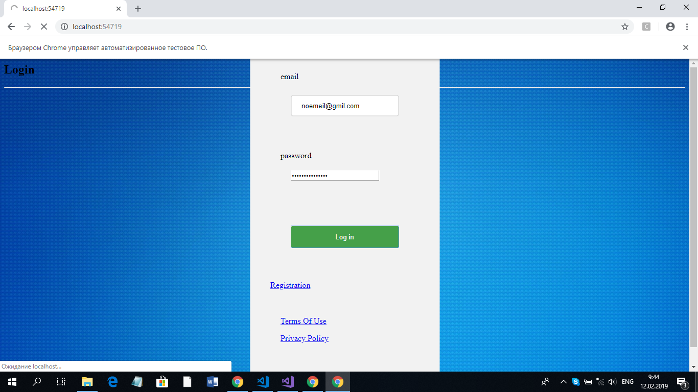
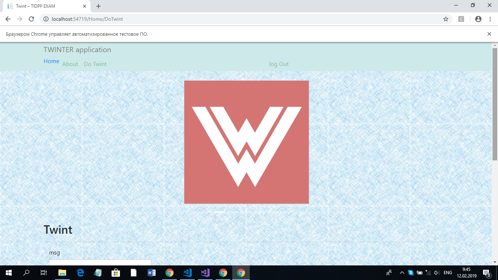
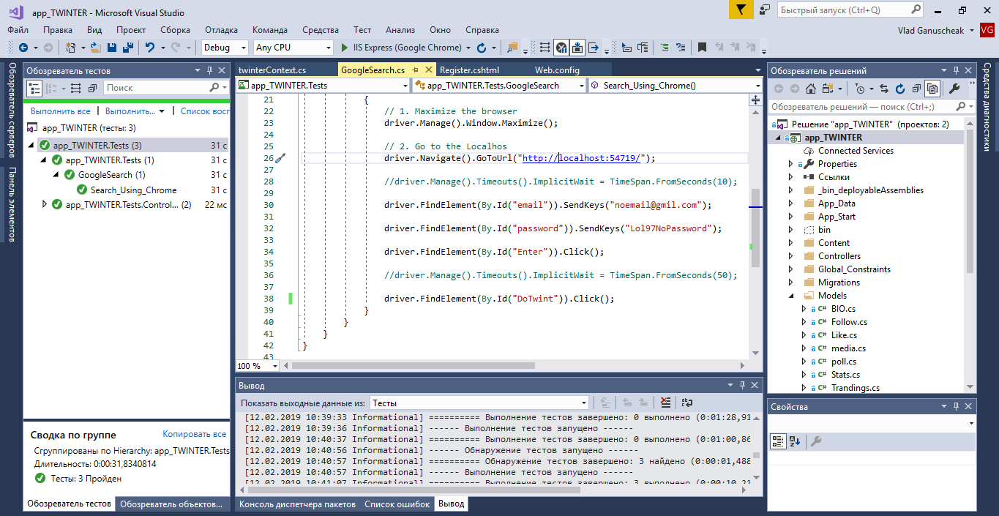

<div align="center">
    
</div>
<div align="center"> 
    <font size = 6>
    <p> Faculty of Computers, Informatics and </p> 
    <p>Microelectronics </p> 
    <p> Technical University of Moldova</p>
    </font>
</div>

<div align="center">
    <br>
    <br>
    <br>
    <br>
    <font size = 5>
        <p>Software Testing</p>
        <p>Laboratory work #1</p>
    </font>
</div>

<div align = "left">
    <br>
    <br>
    <br>
    <font size = 3>
        <p> Author: </p>
        <p> Ganusceac Vlad </p>
        <br>
        <p> Supervisor: </p>
        <p> Popa Dorin </p>
    </font>
</div>

<div align = "center">
    <br>
    <br>
    <br>
    <p> 2019 </p>
    <p> Chişinau </p>
</div>

<P style="page-break-before: always">

## Exercise

***

Create your own Web application and test the LogIn form using Selenium Driver. If authentication was successfull than the web browser should load corresponding message on the screen on another View.

***

## Results:

***

The task says us to create the TestClass with TestMethod for GUI. In this method will be tested the process of the authentication of the user. The test will consist of the part where the user introduces the valid credentials. After that the user has introduced all keys for authentication, he/she should click corresponding button to be able to use the internal functionality of the Website. All this process will be automated in Selenium WebDriver special one for .Net applications.

The test will be considered successful, if the Webdriver class will be able to do some of the specific functionalities (available only after user authentication). In the context of the TWINTER application (custom clone of Twitter) this option is to do Twint or navigate throw different Views. This is possible because I have implemented the following feature: after Log In / Sign Up the system creates Session for user and gets him/her access to another functionalities of site, otherwise the LogIn form will be reloaded, because in each controller there is verefication of user's Session.

## Implementation:

```c#
using System;
using System.Collections.Generic;
using System.Linq;
using System.Text;
using System.Threading.Tasks;
using Microsoft.VisualStudio.TestTools.UnitTesting;
using OpenQA.Selenium.Firefox;
using OpenQA.Selenium.Chrome;
using OpenQA.Selenium;

namespace app_TWINTER.Tests
{
    [TestClass]
    public class GoogleSearch
    {
        [TestMethod]
        public void Search_Using_Chrome()
        {
            // Initializing the Chrome Driver
            using (var driver = new ChromeDriver(@"D:\GIThub\TWINTER\app_TWINTER\packages\Selenium.Chrome.WebDriver.2.45\driver"))
            {
                // 1. Maximize the browser
                driver.Manage().Window.Maximize();

                // 2. Go to the Localhos
                driver.Navigate().GoToUrl("http://localhost:54719/");
                
                // 3. Find element in HTML file by its id: email.
                // Autoitroduct valid key
                driver.FindElement(By.Id("email")).SendKeys("noemail@gmil.com");

                // 4. Same logic... Introducting password key.
                driver.FindElement(By.Id("password")).SendKeys("Lol97NoPassword");
                
                // clicking the button with id="Enter"
                // to go to another view
                driver.FindElement(By.Id("Enter")).Click();

                // In case of success, the LoggedIn View will be loaded
                // and will be available the element of Navbar with id="DoTwint".
                driver.FindElement(By.Id("DoTwint")).Click();
                // If logIn process was successfull, the Selenium Webdriver will load Form for Twint, otherwise this test will be ended with error, because of the permission to pages if the user isn't authenticated.
            }
        }
    }
}
```

[Refference to the code in Github](https://github.com/VladGanuscheak/TWINTER/blob/master/app_TWINTER/app_TWINTER.Tests/GoogleSearch.cs)

<div align="center">
    
</div>

On the picture above You can see the message of the Chrome browser: "Браузером Chrome управляет фитоматизированное тестовое ПО". It means that Selenium WebDriver is lounched and it has entered the credentials to the forms of the localhost site. The LoggedIn View will be loaded for a moment, and after that, will be loaded DoTwint View from Home controller.

<div align="center">
    
</div>

The image above demonstraits the fact that the test was successful. The thing is that in case if the wrong credentials for authentication were introduced, the LogIn View would be reloade and the element with id="DoTwint" wouldn't be available (because it doesn't exist in the context).

<div align="center">
    
</div>

<P style="page-break-before: always">

## Conclusion:

In this laboratory work I have studied how to add Selenium for testing in my .Net prohect and how to set it properly (adding and declaring all the necessary packages). Also it was userful to synchronize UI tests with running application, because if the application wasn't running, the UI test wouldn't get any response from the server and the test would fail.

It is very easy to automatizise a lot of processes with Selenium WebDriver using different HTML parsing methods and actions above it. It is good practice to test Backend of the UI (in this case Log In process) throw the code, because it will save a lot of time for developer/tester and it could be runed a lot of times.

***

